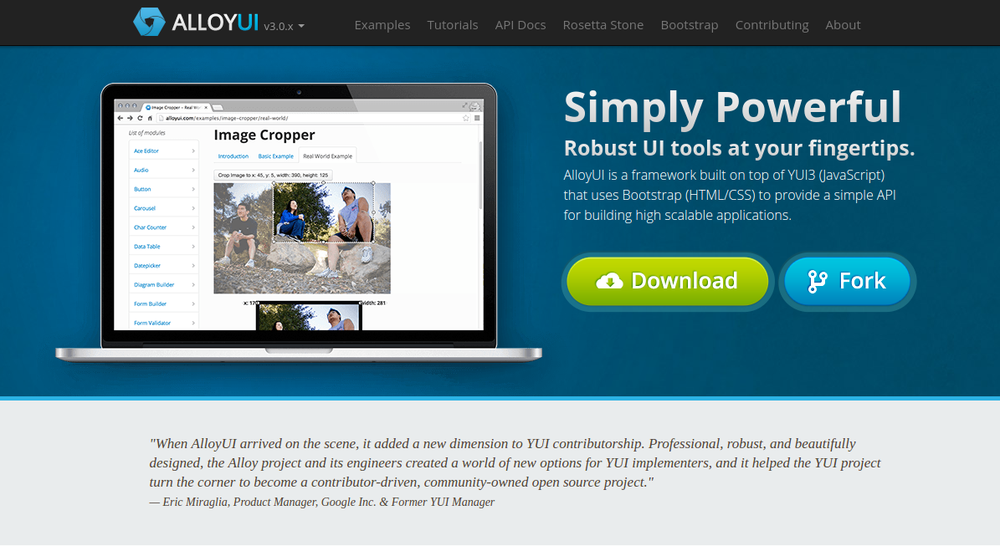
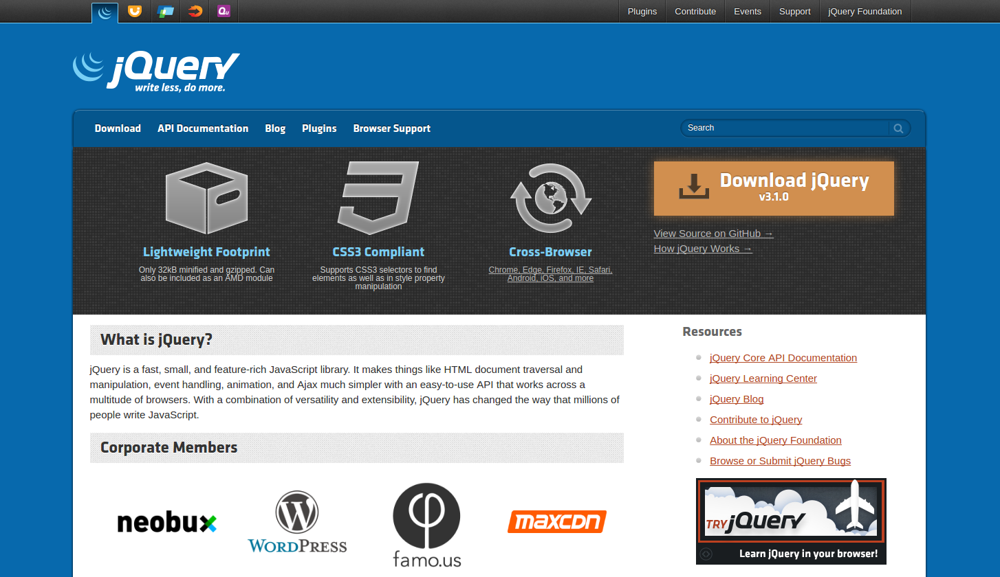

# JavaScript in Liferay Portal 7

## What does JavaScript look like in the portal?

The frontend of Liferay Portal is designed to be extendible, flexible, and future ready.  Like previos version,  many components are written using [AlloyUI](http://alloyui.com/).  AlloyUI is based on [YUI](http://yuilibrary.com/), and is no longer actively maintained.  Because of this we have included [jQuery](https://jquery.com/), and also have developed a new framework called [MetalJS](http://metaljs.com/).

## MetalJS

Metal.js is a JavaScript library for building UI components in a solid, flexible way.  Metal is built from the ground up with performance in mind. Metal is flexible enough to be build as global objects, AMD modules, or jQuery plugins.  By using [ECMAScript 6 (ES6)/ ECMAScript 2015 (ES2015)](http://www.ecma-international.org/ecma-262/6.0/), it has the benefit of easy-to-read and clean code as well as being on the cutting edge of JavaScript.

#### Metal.js is truly the future of front end development in Liferay.


Take a look at this metal-tooltip snippet to see the beauty of Metal.js and ES6.

```javascript
'use strict';

import dom from 'metal-dom';
import Soy from 'metal-soy';
import TooltipBase from './TooltipBase';
import templates from './Tooltip.soy.js';

/**
 * Tooltip component.
 */
class Tooltip extends TooltipBase {
    /**
     * Hides the alert completely (with display "none"). This is called after the
     * hiding animation is done.
     * @protected
     */
    hideCompletely_() {
        if (!this.visible) {
            this.element.style.display = 'none';
        }
    }

    /**
     * State synchronization logic for `visible`. Updates the element's opacity,
     * since bootstrap uses opacity instead of display for tooltip visibility.
     * @param {boolean} visible
     */
    syncVisible(visible) {
        if (!visible) {
            dom.once(this.element, 'animationend', this.hideCompletely_.bind(this));
            dom.once(this.element, 'transitionend', this.hideCompletely_.bind(this));
        } else {
            this.element.style.display = '';
        }

        this.element.style.opacity = visible ? 1 : '';
        super.syncVisible(visible);
    }
}
Soy.register(Tooltip, templates);

/**
 * @inheritDoc
 * @see `Align` class.
 * @static
 */
Tooltip.Align = TooltipBase.Align;

export default Tooltip;
export { Tooltip, TooltipBase };
```

## AlloyUI

AlloyUI is an open source front-end framework built on top of [Yahoo! User Interface Library (YUI)](http://yuilibrary.com).
It leverages all of YUI's modules and adds even more cutting edge components and features to help you build terrific UIs.
* With AlloyUI you can create modern UI components that provide a consistent look & feel across Liferay Portal.
* It is also server-agnostic, which means that you can use it with any technology.




## jQuery

jQuery is a cross-platform JavaScript library designed to simplify the client-side scripting of HTML. It is the most popular JavaScript library in use today. The syntax is designed to make it easier to navigate a document, select DOM elements, create animations, handle events, and develop Ajax applications.

> While jQuery is great for small websites, once you start creating high scalable applications like Java portals you'll need a more robust solution.  That being the case, we strongly recommend you to use one of our other provided solutions.


