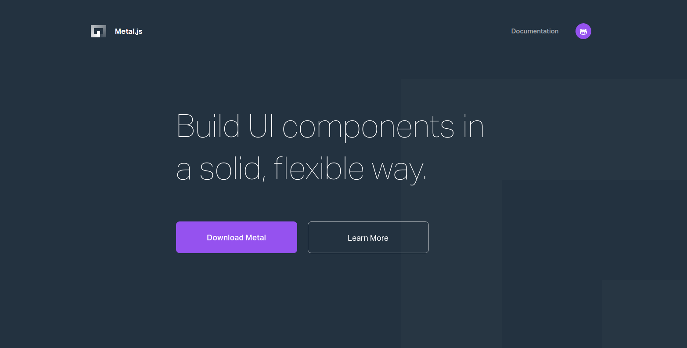
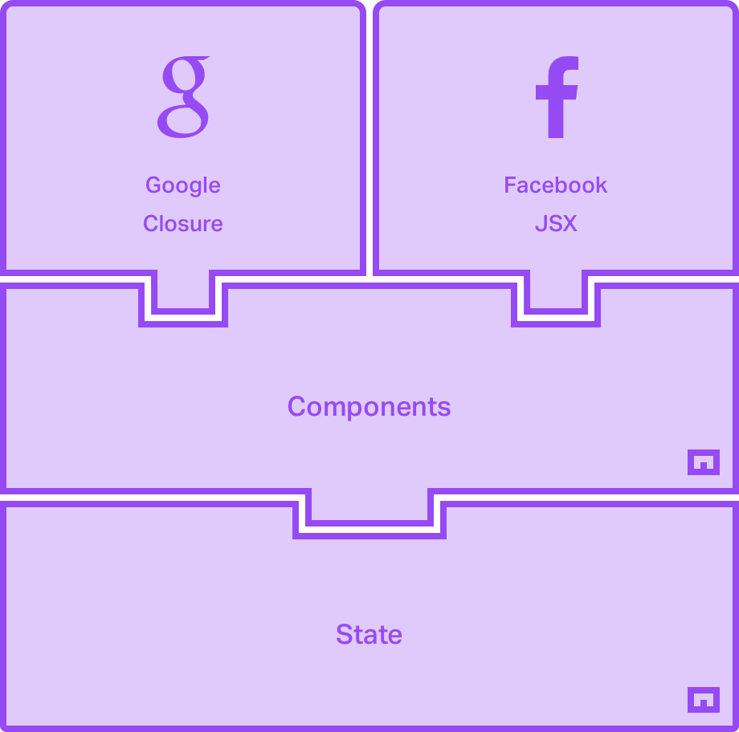

# Metal.js Introduction

## Build UI components in a solid, flexible way.

Metal.js is a lightweight, easy to use JavaScript framework that intgerates with themplating languages to help you create UI Componenents easily.



## Architecture

Metal.js' main classes are State and Component. Component actually extends from State, thus containing all its features. The main difference between the two is that Component's extra features are related to rendering. So you could just use State directly if your module doesn't do any rendering. But if your module does need rendering logic, then Component will work better for you.

Many people have their own favorite way of dealing with rendering logic. Some prefer to use template languages that completely separate it from the business logic, while others like to keep both close together in the same file. Metal.js doesn't force developers to go with only one of those.

The structure visualised would look like this: 



## Templates

 By default Metal.js offers integration points with both closure templates from Google and JSX from Facebook, and it's possible to add more options, since the rendering layer is customizable.

 A Soy template in Metal.js may look like this

 ```html
 {template .render}
   // ...
   <button onClick="{$close}" type="button" class="close">
   // ...
 {/template}
 ```


## ECMAScript 6/2015

[ECMAScript 6, also known as ECMAScript 2015](http://www.ecma-international.org/ecma-262/6.0/), is the latest version of the ECMAScript standard. ES6 is a significant update to the language, and the first update to the language since ES5 was standardized in 2009. Here is a short list of some of the benefits of using ES6:

- Class syntax like other OO languages. Classes support prototype-based inheritance, super calls, instance and static methods and constructors.
- Arrow method syntax. `var odds = numbers.map(v => v + 1);`
- Language-level support for modules for component definition. Codifies patterns from popular JavaScript module loaders like AMD.
```javascript
export function sum(x, y) {
  return x + y;
}
export var pi = 3.141593;
```
- And many more!

A Metal.js component written in ES6 may look like this:

```javascript
class MyComponent extends Component {
    created() {
        //do some things
    }

    disposed() {
        //do some other things
    }
}
```

**These just scratch the surface of the new features in ECMASCRIPT 2015 that can be leveraged in Metal.js.**