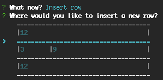
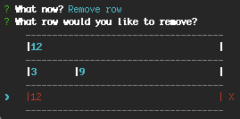

# Creating Layout Templates with the Themes Generator

## Generator

The Themes Generator is a set of Yeoman generators that are used to create themes, themelets, and layout templates. After installing `generator-liferay-theme` and it's dependencies run the following command to start the Layout Template generator.

```
yo liferay-theme:layout
```

This will create a new folder for your layout template in your current working directory Follow the prompts to create the layout template:

1. Enter a name and ID for your layout template, or press Enter to accept the default values.

2. Choose your Liferay version and press Enter to continue.

	At this point the layout template design process begins. As the generator states, Layout templates implement Bootstrap's grid system. Every row consists of 12 sections, so columns range in size from 1 to 12. The sub-generator is user-friendly, allowing you to add and remove rows and columns as you design.

3. Enter the number of columns you would like for `row 1`.

	Once you've entered a value, the generator asks how wide you want each column to be, and presents you with the available width(s).

4. Choose from the available option(s) with your arrow keys and press Enter to make your selection.

	Once you're done configuring your row, you are presented with a few options:

	- Add a row: adds a row below the last row

	- Insert row: allows you to inject a new row somewhere in the existing layout

	

	- Remove row: allows you to remove a row from the current layout

	

	- Finish row: generates layout template files

5. Enter the path to your app server directory.

6. Finally, enter the URL to your server or press Enter to accept the default `http://localhost:8080` development site.

Once the generator is done, you should see `docroot/{layout-name}.tpl` in your layout template directory that reflects the layout you created.

```html
<div class="my-liferay-layout" id="main-content" role="main">
	<div class="portlet-layout row">
		<div class="col-md-3 portlet-column portlet-column-first" id="column-1">
			$processor.processColumn("column-1", "portlet-column-content portlet-column-content-first")
		</div>
		<div class="col-md-9 portlet-column portlet-column-last" id="column-2">
			$processor.processColumn("column-2", "portlet-column-content portlet-column-content-last")
		</div>
	</div>
</div>
```

## Deploying

After the layout template generator is done, it installs npm dependencies used for deployment. To deploy, navigate to the layout template directory and invoke the following gulp task.

```
gulp deploy
```

If you need to change the the location of your appserver, run the following task and follow the prompts.

```
gulp init
```
