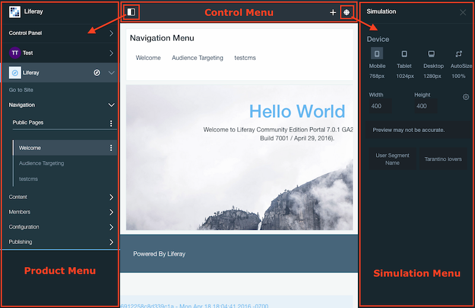

**MOVED TO: 03-theme-development/07-theme-contributors.md**

# Theme Contributors

If you would like to package UI resources, independent of a specific theme, and include them on the page, Theme Contributors are the tool for you.

## What is a Theme Contributor?

A theme contributor is a module that contains UI resources to use in Liferay 7 and DXP. The module is scanned for all valid CSS and JS files, and then includes the resources on the page.

## Identifying existing Theme Contributor modules

In Liferay versions prior to 7.0, the standard UI for User menus and navigation, such as the Dockbar, was included in the theme template. Starting in Liferay 7.0, these standard UI components are packaged as theme contributors.

Specifically, the Control Menu, Product Menu, and Simulation Panel, are packaged in theme contributor modules in Liferay, removing them from a theme. Instead, styles for these specific UI components can be handled outside of the theme.



If you want to edit or style these standard UI components, you’ll need to modify the module directly and rebuild it.

To identify your module as a theme contributor add the `Liferay-Theme-Contributor-Type` property to the bnd.bnd file.  For example the Control Menu has the configuration below:

```
Bundle-Name: Liferay Product Navigation Control Menu Theme Contributor
Bundle-SymbolicName: com.liferay.product.navigation.control.menu.theme.contributor
Bundle-Version: 1.0.0
Liferay-Releng-Module-Group-Description:
Liferay-Releng-Module-Group-Title: Product Navigation
Liferay-Theme-Contributor-Type: product-navigation-control-menu
Web-ContextPath: /product-navigation-control-menu-theme-contributor
-include: ../../../../../marketplace/web-content-management/bnd.bnd
```

## Editing Theme Contributors

Theme contributors are, simply, packaged UI components, as mentioned earlier. To edit a theme contributor UI component, for instance to style one, follow these steps:

1. Open the Command Line and navigate to the theme contributor module. For instance, the Product Menu Theme Contributor module resides in the following directory:

    `liferay-portal/modules/apps/web-experience/product-navigation/product-navigation-product-menu-theme-contributor`

2. Navigate to the `src/main/resources/META-INF/resources` directory for the module and edit the file you want to update.

3. Save the file and navigate back to the module’s root directory.

4. Run `../../../../../gradlew deploy` to build and deploy the updated jar file.

That’s all you need to do to create a theme contributor for your site. Remember, with great power there must also come–great responsibility, so use theme contributors wisely. The UI contributions will affect every page, and will remain, regardless of the theme.