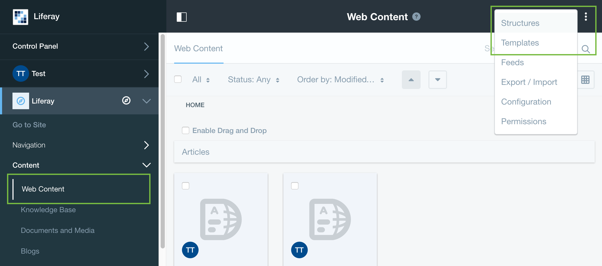

# Importing Resources

The Resources Importer allows developers to deploy their themes with predefined content. This is useful for showcasing a theme, and also provides a site template which can be used for creating new sites with a predefined look and feel.

## Resource File Structure

All theme resources reside in the `{theme-name}/src/WEB-INF/src/resources-importer` folder. Here is an example file structure.

- `resources-importer`
	- `sitemap.json`
	- `assets.json`
	- `document_library/`
		- `documents/`
	- `journal/`
		- `articles/`
		- `structures/`
		- `templates/`

## Sitemap `sitemap.json`

The sitemap defines the pages of the site or site template to be imported, along with the layout templates, portlets, and portlet preferences of these pages.

```JSON
{
	"layoutTemplateId": "2_columns_ii",
	"publicPages": [
		{
			"columns": [
				[
					{
						"portletId": "com_liferay_login_web_portlet_LoginPortlet"
					}
				],
				[
					{
						"portletId": "com_liferay_hello_world_web_portlet_HelloWorldPortlet"
					}
				]
			],
			"friendlyURL": "/home",
			"name": "Welcome",
			"title": "Welcome"
		}
	]
}
```

This sitemap will create one page named `Welcome` that has two columns, one with the Login portlet and the other with the Hello World portlet.

## Assets `assets.json`

The assets.json file specifies details about the assets to be imported. Tags can be applied to any asset. Abstract summaries and small images can be applied to web content articles.

```JSON
{
	"assets": [
		{
			"name": "company_logo.png",
			"tags": [
				"logo",
				"company"
			]
		},
		{
			"abstractSummary": "This is an abstract summary.",
			"name": "My Example Content.xml",
			"smallImage": "company_logo.png",
			"tags": [
				"web content"
			]
		}
	]
}
```

## Documents and Media `document_library`

The `document_library` directory is used for importing files to Documents and Media.

- `document_library/`
	- `documents/`
		- `image.png`
		- `Custom Folder`
			- `image 2.png`

With this example file structure `image.png` will be placed in the root folder of the Documents and Media portlet. `image 2.png` will be placed in a folder named `Custom Folder`.

## Web Content `journal`

The `journal` directory is used for importing various assets related to web content, such as structures (JSON), templates (Velocity/Freemarker), and web content articles (XML).

- `journal/`
	- `articles/`
		- `Example Content Template 1/` - matches template name
			- `My Example Content.xml`
	- `structures/`
		- `Example Content.json`
	- `templates/`
		- `Example Content/` - matches structure name
			- `Example Content Template 1.ftl`
			- `Example Content Template 2.ftl`

This example `journal` file structure imports a web content structure named `Example Content`, notice that the `templates` affiliated with this structure are nested in a folder of the same name as the structure. Similarly, `articles` that are affiliated with a template are nested in a folder of the same name as the template.

Let's take a closer look at these individual assets.

### `Example Content.json`

```JSON
{
	"availableLanguageIds": [
		"en_US"
	],
	"defaultLanguageId": "en_US",
	"fields": [
		{
			"label": {
				"en_US": "Header"
			},
			"predefinedValue": {
				"en_US": ""
			},
			"style": {
				"en_US": ""
			},
			"tip": {
				"en_US": ""
			},
			"dataType": "string",
			"indexType": "keyword",
			"localizable": true,
			"name": "Header",
			"readOnly": false,
			"repeatable": false,
			"required": false,
			"showLabel": true,
			"type": "text"
		},
		{
			"label": {
				"en_US": "Body"
			},
			"predefinedValue": {
				"en_US": ""
			},
			"style": {
				"en_US": ""
			},
			"tip": {
				"en_US": ""
			},
			"dataType": "string",
			"indexType": "keyword",
			"localizable": true,
			"name": "Body",
			"readOnly": false,
			"repeatable": false,
			"required": false,
			"showLabel": true,
			"type": "textarea"
		}
	]
}
```

The source JSON of web content structures can be found by clicking the `Source` tab while editing the structure.

Both structures and templates can be created/edited by navigating to the Web Content Management portlet via the product menu.



### `Example Content Template 1.ftl`

```
<h1>${Header.getData()}</h1>

${Body.getData()}
```

### `My Example Content.xml`

```xml
<?xml version="1.0"?>

<root available-locales="en_US" default-locale="en_US">
	<dynamic-element name="Header" type="text" index-type="keyword" instance-id="mdyl">
		<dynamic-content language-id="en_US"><![CDATA[Header]]></dynamic-content>
	</dynamic-element>
	<dynamic-element name="Body" type="text_box" index-type="keyword" instance-id="opiq">
		<dynamic-content language-id="en_US"><![CDATA[Body]]></dynamic-content>
	</dynamic-element>
</root>
```

To access the source XML of an article, navigate to the edit page of the article and click the `View Source` option.


### Adding `Example Content` to `sitemap.json`

To add our `Example Content` to the sitemap, we must add a Web Content Display portlet to one of our pages, and point it to the correct article. Here we will add the web content portlet directly below the Hello World portlet.

```JSON
{
	"layoutTemplateId": "2_columns_ii",
	"publicPages": [
		{
			"columns": [
				[
					{
						"portletId": "com_liferay_login_web_portlet_LoginPortlet"
					}
				],
				[
					{
						"portletId": "com_liferay_hello_world_web_portlet_HelloWorldPortlet"
					},
					{
						"portletId": "com_liferay_journal_content_web_portlet_JournalContentPortlet",
						"portletPreferences": {
							"articleId": "My Example Content.xml",
							"groupId": "${groupId}",
							"portletSetupShowBorders": "true",
							"portletSetupTitle_en_US": "Web Content Display with Custom Title",
							"portletSetupUseCustomTitle": "true"
						}
					}
				]
			],
			"friendlyURL": "/home",
			"name": "Welcome",
			"title": "Welcome"
		}
	]
}
```

## Deploying Resources

Now that you have the necessary `sitemap.json` and `journal` assets, simply deploy your theme. With the default configuration the resources importer will create a site template sharing the name of your theme.


Clicking on the name of the site template will show you a preview of your theme with the imported resources. You can also create a new site based off the site template that will contain all imported resources.

## Importing Resources to Existing Sites

You can configure resources importer to import resources into an existing site rather than a site template by defining the following properties in `{theme-name}/src/WEB-INF/liferay-plugin-package.properties`.

```
resources-importer-target-class-name=com.liferay.portal.kernel.model.Group

resources-importer-target-value=[site-name]
```

## Developer Mode

Themes created via the Themes Generator have the resources importer developer mode enabled by default in the `liferay-plugin-package.properties` file.

```
resources-importer-developer-mode-enabled=true
```

When this property is set to `true` the resources importer deletes and re-creates the target site or site template. While this is useful for development, it should never be used in a production environment.
